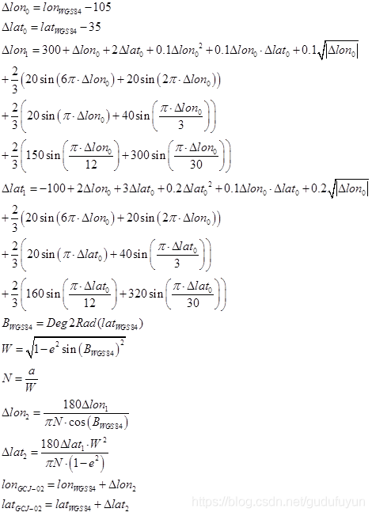
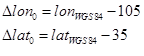
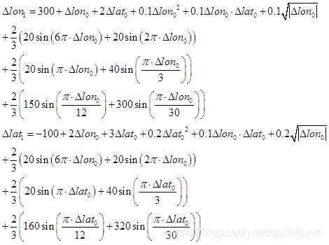
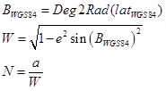
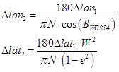
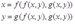
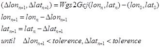
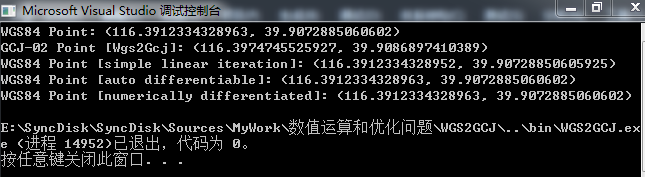

# 使用Ceres实现WGS84到GCJ-02座标相互转换

https://www.twblogs.net/a/5efc63ff99927402d4fc6198/?lang=zh-cn

https://blog.csdn.net/gudufuyun/article/details/106721340


## 前言


最近偶然才知道有GCJ-02这个座标系，作为测绘从业人员，直到现在才知道我国还存在这么一个座标系，实在感觉有些对不起专业。不过我主要做航摄，平时也主要接触的是真实大地座标，航摄成图的后续处理也从未关注过，之前确实没有接触过这一座标系统。

目前WGS84到GCJ-02座标的转换算法似乎已经是公开的，公开搜索到了好几个WGS84到GCJ-02的转换代码，核心算法都是一致的，大家似乎使用了同一加密公式。假设这一公式确实是李成民实现WGS84到GCJ-02座标转换使用的精确公式，那么从加密过程看，使用的公式也只是普通的多项式，并没有使用其他特殊处理。相应的反解时，基于加密公式列非线性方程，使用牛顿迭代法完全可以获取非线性方程的数值解。理论上给定迭代收敛条件，完全可以获得较高精度的迭代数值解。

即使网上流传的加密算法使用的加密公式并非原版，只是近似加密公式。只要李成民在对WGS84座标加密时并没有做特殊处理，两个座标系的座标变换还是通过多项式变换，高精度的纠偏算法还是可以实现的。主要是现在有ceres这一神器，使用ceres的数值求导完全可以解决这一问题。将GCJ-02座标当做观测值列误差方程，调用国家保密插件配合ceres数值求导计算residuals就行。

在知乎跟踪这个问题时，我表达了类似的看法，有知友不相信我的结论，于是这里我借助ceres实现WGS84到GCJ-02座标大相互转换。因为我手上也没有国家保密插件，只能当网上公开的加密算法使用的加密公式是精确公式。

## 公开的加、解密算法

这里我收集了2个版本的加解密算法。

第一个是来自博客园的文章 [《GCJ-02火星座标系和WGS-84座标系转换关系》](https://www.cnblogs.com/langzou/p/10402501.html) ，代码如下：

```python
# -*- coding: utf-8 -*-
import json
import math

x_pi = 3.14159265358979324 * 3000.0 / 180.0
pi = 3.1415926535897932384626  # π
a = 6378245.0  # 长半轴
ee = 0.00669342162296594323  # 扁率

def wgs84togcj02(lng, lat):
    """
    WGS84转GCJ02(火星座标系)
    :param lng:WGS84座标系的经度
    :param lat:WGS84座标系的纬度
    :return:
    """
    if out_of_china(lng, lat):  # 判断是否在国内
        return lng, lat
    dlat = transformlat(lng - 105.0, lat - 35.0)
    dlng = transformlng(lng - 105.0, lat - 35.0)
    radlat = lat / 180.0 * pi
    magic = math.sin(radlat)
    magic = 1 - ee * magic * magic
    sqrtmagic = math.sqrt(magic)
    dlat = (dlat * 180.0) / ((a * (1 - ee)) / (magic * sqrtmagic) * pi)
    dlng = (dlng * 180.0) / (a / sqrtmagic * math.cos(radlat) * pi)
    mglat = lat + dlat
    mglng = lng + dlng
    return [mglng, mglat]


def gcj02towgs84(lng, lat):
    """
    GCJ02(火星座标系)转GPS84
    :param lng:火星座标系的经度
    :param lat:火星座标系纬度
    :return:
    """
    if out_of_china(lng, lat):
        return lng, lat
    dlat = transformlat(lng - 105.0, lat - 35.0)
    dlng = transformlng(lng - 105.0, lat - 35.0)
    radlat = lat / 180.0 * pi
    magic = math.sin(radlat)
    magic = 1 - ee * magic * magic
    sqrtmagic = math.sqrt(magic)
    dlat = (dlat * 180.0) / ((a * (1 - ee)) / (magic * sqrtmagic) * pi)
    dlng = (dlng * 180.0) / (a / sqrtmagic * math.cos(radlat) * pi)
    mglat = lat + dlat
    mglng = lng + dlng
    return [lng * 2 - mglng, lat * 2 - mglat]


def transformlat(lng, lat):
    ret = -100.0 + 2.0 * lng + 3.0 * lat + 0.2 * lat * lat + \
        0.1 * lng * lat + 0.2 * math.sqrt(math.fabs(lng))
    ret += (20.0 * math.sin(6.0 * lng * pi) + 20.0 *
            math.sin(2.0 * lng * pi)) * 2.0 / 3.0
    ret += (20.0 * math.sin(lat * pi) + 40.0 *
            math.sin(lat / 3.0 * pi)) * 2.0 / 3.0
    ret += (160.0 * math.sin(lat / 12.0 * pi) + 320 *
            math.sin(lat * pi / 30.0)) * 2.0 / 3.0
    return ret


def transformlng(lng, lat):
    ret = 300.0 + lng + 2.0 * lat + 0.1 * lng * lng + \
        0.1 * lng * lat + 0.1 * math.sqrt(math.fabs(lng))
    ret += (20.0 * math.sin(6.0 * lng * pi) + 20.0 *
            math.sin(2.0 * lng * pi)) * 2.0 / 3.0
    ret += (20.0 * math.sin(lng * pi) + 40.0 *
            math.sin(lng / 3.0 * pi)) * 2.0 / 3.0
    ret += (150.0 * math.sin(lng / 12.0 * pi) + 300.0 *
            math.sin(lng / 30.0 * pi)) * 2.0 / 3.0
    return ret


def out_of_china(lng, lat):
    """
    判断是否在国内，不在国内不做偏移
    :param lng:
    :param lat:
    :return:
    """
    if lng < 72.004 or lng > 137.8347:
        return True
    if lat < 0.8293 or lat > 55.8271:
        return True
    return False


if __name__ == '__main__':
    [lng,lat]=[114.061202,22.529388]
    [dstlng, dstlat] = gcj02towgs84(lng, lat)
    print(dstlng, dstlat)
```

第二个版本是知乎上一篇文章 [《【对错代码分辨】wgs84座标系和火星座标系的转换中的对与错》](https://zhuanlan.zhihu.com/p/107253611) 引用的QGIS相关插件作者geohey提供的转换代码：

```python
# -*- coding: utf-8 -*-
##########################################################################################
"""
/***************************************************************************
 OffsetWGS84Core
                                 A QGIS plugin
 Class with methods for geometry and attributes processing
                              -------------------
        begin                : 2016-10-11
        git sha              : $Format:%H$
        copyright            : (C) 2017 by sshuair
        email                : sshuair@gmail.com
 ***************************************************************************/

/***************************************************************************
 *                                                                         *
 *   This program is free software; you can redistribute it and/or modify  *
 *   it under the terms of the GNU General Public License as published by  *
 *   the Free Software Foundation; either version 2 of the License, or     *
 *   (at your option) any later version.                                   *
 *                                                                         *
 ***************************************************************************/
"""
from __future__ import print_function
##########################################################################################
from builtins import zip
import math
from math import sin, cos, sqrt, fabs, atan2
from math import pi as PI
# from numba import jit


# =================================================sshuair=============================================================
# define ellipsoid
a = 6378245.0
f = 1 / 298.3
b = a * (1 - f)
ee = 1 - (b * b) / (a * a)

# check if the point in china
def outOfChina(lng, lat):
    return not (72.004 <= lng <= 137.8347 and 0.8293 <= lat <= 55.8271)

# @jit
def geohey_transformLat(x, y):
    ret = -100.0 + 2.0 * x + 3.0 * y + 0.2 * y * y + 0.1 * x * y + 0.2 * sqrt(fabs(x))
    ret = ret + (20.0 * sin(6.0 * x * PI) + 20.0 * sin(2.0 * x * PI)) * 2.0 / 3.0
    ret = ret + (20.0 * sin(y * PI) + 40.0 * sin(y / 3.0 * PI)) * 2.0 / 3.0
    ret = ret + (160.0 * sin(y / 12.0 * PI) + 320.0 * sin(y * PI / 30.0)) * 2.0 / 3.0
    return ret

# @jit
def geohey_transformLon(x, y):
    ret = 300.0 + x + 2.0 * y + 0.1 * x * x +  0.1 * x * y + 0.1 * sqrt(fabs(x))
    ret = ret + (20.0 * sin(6.0 * x * PI) + 20.0 * sin(2.0 * x * PI)) * 2.0 / 3.0
    ret = ret + (20.0 * sin(x * PI) + 40.0 * sin(x / 3.0 * PI)) * 2.0 / 3.0
    ret = ret + (150.0 * sin(x / 12.0 * PI) + 300.0 * sin(x * PI / 30.0)) * 2.0 / 3.0
    return ret

# @jit
def wgs2gcj(wgsLon, wgsLat):
    if outOfChina(wgsLon, wgsLat):
        return wgsLon, wgsLat
    dLat = geohey_transformLat(wgsLon - 105.0, wgsLat - 35.0)
    dLon = geohey_transformLon(wgsLon - 105.0, wgsLat - 35.0)
    radLat = wgsLat / 180.0 * PI
    magic = math.sin(radLat)
    magic = 1 - ee * magic * magic
    sqrtMagic = sqrt(magic)
    dLat = (dLat * 180.0) / ((a * (1 - ee)) / (magic * sqrtMagic) * PI)
    dLon = (dLon * 180.0) / (a / sqrtMagic * cos(radLat) * PI)
    gcjLat = wgsLat + dLat
    gcjLon = wgsLon + dLon
    return (gcjLon, gcjLat)


def gcj2wgs(gcjLon, gcjLat):
    g0 = (gcjLon, gcjLat)
    w0 = g0
    g1 = wgs2gcj(w0[0], w0[1])
    # w1 = w0 - (g1 - g0)
    w1 = tuple([x[0]-(x[1]-x[2]) for x in zip(w0,g1,g0)])  
    # delta = w1 - w0
    delta = tuple([x[0] - x[1] for x in zip(w1, w0)])
    while (abs(delta[0]) >= 1e-6 or abs(delta[1]) >= 1e-6):
        w0 = w1
        g1 = wgs2gcj(w0[0], w0[1])
        # w1 = w0 - (g1 - g0)
        w1 = tuple([x[0]-(x[1]-x[2]) for x in zip(w0,g1,g0)])
        # delta = w1 - w0
        delta = tuple([x[0] - x[1] for x in zip(w1, w0)])
    return w1


def gcj2bd(gcjLon, gcjLat):
    z = sqrt(gcjLon * gcjLon + gcjLat * gcjLat) + 0.00002 * sin(gcjLat * PI * 3000.0 / 180.0)
    theta = atan2(gcjLat, gcjLon) + 0.000003 * cos(gcjLon * PI * 3000.0 / 180.0)
    bdLon = z * cos(theta) + 0.0065
    bdLat = z * sin(theta) + 0.006
    return (bdLon, bdLat)


def bd2gcj(bdLon, bdLat):
    x = bdLon - 0.0065
    y = bdLat - 0.006
    z = sqrt(x * x + y * y) - 0.00002 * sin(y * PI * 3000.0 / 180.0)
    theta = atan2(y, x) - 0.000003 * cos(x * PI * 3000.0 / 180.0)
    gcjLon = z * cos(theta)
    gcjLat = z * sin(theta)
    return (gcjLon, gcjLat)


def wgs2bd(wgsLon, wgsLat):
    gcj = wgs2gcj(wgsLon, wgsLat)
    return gcj2bd(gcj[0], gcj[1])


def bd2wgs(bdLon, bdLat):
    gcj = bd2gcj(bdLon, bdLat)
    return gcj2wgs(gcj[0], gcj[1])


if __name__ == '__main__':
    # wgs2gcj
    # coord = (112, 40)
    # trans = WGS2GCJ()
    print(wgs2gcj(112, 40))
    print(gcj2wgs(112.00678230985764, 40.00112245823686))

    # gcj2wgs
```

可以观察到，两个版本使用的加密公式完全一致，由WGS84到GCS-02的转换依据以下公式：

（式1）

首先分析下这个公式：

由于我国经度范围73°33′E至135°05′E，纬度范围：3°51′N至53°33′N。因此，大地座标（105.0°E，35.0°N）大致位于我国中心。第一步变形：

 （式2）

**相当于计算大地点相对于中心点的经纬度偏移量**，这里经纬度单位为度。

第二步变形：

 （式3）

其**本质是将大地点座标相对中心点的偏移量由经度直接视为米**（m），通过正弦周期函数和多项式拟合一个米制单位的大地点偏移量。

 （式4）

公式4中e为参考椭球**第一偏心率**，对应的e2为**第一偏心率的平方**，a为**参考椭球长半轴**，W为**第一辅助系数**，N实际上是WGS84座标系下该点对应的**椭球面卯酉圈曲率半径**（单位：m）。

第三步变形：

 （式5）

**式5中N·cosB实际上是参考椭球面上一点到参心直角座标系原点的距离在卯酉圈上的投影距离。式5分子分母相除可以获得一个无量纲数值，将这个数值视为大地点经纬度相对WGS84座标经纬度加偏量的弧度角，通过弧度到角度的转换可以获得大地点经纬度座标相对WGS84座标系的大地座标偏移。**

从公开的公式分析，加密过程并不复杂，也不算很巧妙，只是用上了一些大地测量的基础知识，可能会让非大地测量专业人员感到迷惑。值得注意的是，整个加密过程使用的椭球常数居然是**克拉索夫斯基椭球**（北京1954座标系使用的参考椭球），将WGS84座标直接带入克拉索夫斯基椭球进行计算也是相当6了！

接下来分析下博客园和geohey实现的反解代码：

博客园的纠偏算法就很简单粗暴了，他是直接将加密公式也当做反解公式进行计算，带入GCJ-02座标，通过同一公式计算得到WGS84座标。很显然，只有加密公式满足



这一条件时，纠偏才无误差。很显然这种处理是存在很大误差的。

Geohey实现的反解算法则是一个简单的迭代算法，他的迭代公式如下：



这是一个简单的迭代算法，已经具有较高的反解精度，只是迭代收敛速度略慢。

## 早期查表法原理

早期WGS84到GCJ-02座标转换算法未公开（加密算法未公开），虽然理论上当时也可以通过简单迭代法进行反解，可能因为硬件限制，当时处理迭代算法比较慢，早期并未采用这一策略。而一个比较容易想到的办法就是查表法。

既然国测局对用户提供了加密插件对真实的WGS84座标进行加偏，那么用户完全可以借助这一工具按照一定密度对全国范围内的地面点（高程为0）的大地座标进行加偏处理，得到对应的加偏后座标，建立一个加偏座标值表。

当需要反解时，可以首先将加偏座标值表中所有点取出，构建三角网，判断需要反解的座标值落入哪一个三角网内部，通过三角网3个顶点的加偏点座标值反查对应的3个顶点真实座标值，通过三角网内插即可以获得一定精度的大地点真实座标值。

实际上当加偏座标值表中的加偏点分布足够密集，通过这种方式依然可以获得高精度的反解座标。并且三角网内插也只是一种方式，也可以查找附近最小距离的N个点，按照距离加权平均值。这种处理特别像通过三维点云构建格网DEM的三角网构网法和移动曲面拟合法。

## 基于牛顿迭代法的反解方法

根据公开的加密公式（式1）分析，WGS84到GCJ-02座标转换只是一个简单多项式计算，并未做一些特殊混淆处理（假设加密过程用到了分区间查表配合多项式，让两者转换关系变为非连续函数，则问题就很难处理了）。因此，进行反解时，完全可以借助加密公式列非线性方程，反解问题就成了解非线性方程。

牛顿迭代法是非线性方程数值解一个很常见的方法。它将原方程函数进行泰勒展开，取展开式线性项作为原方程的近似方程，因为线性项是线性的，近似方程的求解是解线性方程。通过迭代处理，直到近似方程的未知数接近于0。

牛顿迭代法在收敛范围内会比Geohey实现的简单迭代法收敛速度快，但是列出近似线性方程时，方程的系数矩阵即雅克比矩阵涉及到复杂的偏导计算，在某些平台上（例如某些嵌入式开发，因硬件性能所限）可能不会采用这种方法。但在PC平台上，采用牛顿迭代法进行座标反解完全不存在任何问题，并且可以获得较高的转换精度。

由于雅克比矩阵的推导过程涉及比较复杂的偏导计算（实际上公式1对△lon，△lat求偏导也不算太复杂），为了保证计算可靠性，我们直接省去了人工求导过程，可以借助Ceres自动求导。

基于Ceres的自动求导实现反解代码：

```c++
class AutoDiffCostFunc
{
public:
    AutoDiffCostFunc(const double lon, const double lat) :
        mlonGcj(lon), mlatGcj(lat) {}
	template <typename T>
    bool operator() (const T* const lonWgs, const T* const latWgs, T* residuals) const
    {
		//get geodetic offset relative to 'center china'
		T lon0 = lonWgs[0] - T(105.0);
		T lat0 = latWgs[0] - T(35.0);

		//generate an pair offset roughly in meters
		T lon1 = T(300.0) + lon0 + T(2.0) * lat0 + T(0.1) * lon0 * lon0 + T(0.1) * lon0 * lat0
            + T(0.1) * ceres::sqrt(ceres::abs(lon0));
		lon1 = lon1 + (T(20.0) * ceres::sin(T(6.0) * lon0 * T(PI)) + T(20.0) * ceres::sin(T(2.0) * lon0 * T(PI))) * T(2.0) / T(3.0);
		lon1 = lon1 + (T(20.0) * ceres::sin(lon0 * T(PI)) + T(40.0) * ceres::sin(lon0 / T(3.0) * T(PI))) * T(2.0) / T(3.0);
		lon1 = lon1 + (T(150.0) * ceres::sin(lon0 / T(12.0) * T(PI)) + T(300.0) * ceres::sin(lon0 * T(PI) / T(30.0))) * T(2.0) / T(3.0);
		T lat1 = T(-100.0) + T(2.0) * lon0 + T(3.0) * lat0 + T(0.2) * lat0 * lat0 + T(0.1) * lon0 * lat0
            + T(0.2) * ceres::sqrt(ceres::abs(lon0));
		lat1 = lat1 + (T(20.0) * ceres::sin(T(6.0) * lon0 * T(PI)) + T(20.0) * ceres::sin(T(2.0) * lon0 * T(PI))) * T(2.0) / T(3.0);
		lat1 = lat1 + (T(20.0) * ceres::sin(lat0 * T(PI)) + T(40.0) * ceres::sin(lat0 / T(3.0) * T(PI))) * T(2.0) / T(3.0);
		lat1 = lat1 + (T(160.0) * ceres::sin(lat0 / T(12.0) * T(PI)) + T(320.0) * ceres::sin(lat0 * T(PI) / T(30.0))) * T(2.0) / T(3.0);

		//latitude in radian
		T B = latWgs[0] * T(kDEG2RAD);
		T sinB = ceres::sin(B), cosB = ceres::cos(B);
        T W = ceres::sqrt(T(1) - T(kKRASOVSKY_ECCSQ) * sinB * sinB);
        T N = T(kKRASOVSKY_A) / W;

		//geodetic offset used by GCJ-02
		T lon2 = T(kRAD2DEG) * lon1 / (N * cosB);
		T lat2 = T(kRAD2DEG) * (lat1 * W * W / (N * (1 - kKRASOVSKY_ECCSQ)));

        //residuals
        residuals[0] = lonWgs[0] + lon2 - mlonGcj;
        residuals[1] = latWgs[0] + lat2 - mlatGcj;
        return true;
    }

private:
    double mlonGcj;
    double mlatGcj;
};

/**
 *  \brief Covert geodetic coordinate in GCJ-02 coordinate system to geodetic coordinate
 *         in WGS84 coordinate system
 *
 *  \param [in] gcj02lon: longitude in GCJ-02 coordinate system [unit:degree]
 *  \param [in] gcj02lat: latitude in GCJ-02 coordinate system [unit:degree]
 *  \return Returns geodetic coordinate in WGS84 coordinate system
 *  \remark the encryption formula is known and use an auto-differentiable cost function
 *  \time 15:51:13 2020/06/12
 */
std::pair<double, double> Gcj2Wgs_AutoDiff(const double& gcj02lon,
    const double& gcj02lat)
{
	ceres::Problem * poProblem = new ceres::Problem;
    AutoDiffCostFunc* pCostFunc = new AutoDiffCostFunc(gcj02lon,gcj02lat);

    double wgslon =  gcj02lon , wgslat =  gcj02lat;
	poProblem->AddResidualBlock(new ceres::AutoDiffCostFunction<AutoDiffCostFunc, 2, 1, 1>(pCostFunc),
        nullptr,
        &wgslon,
        &wgslat);

	ceres::Solver::Options options;
	options.max_num_iterations = 30;
	options.linear_solver_type = ceres::DENSE_QR;
	options.minimizer_progress_to_stdout = false;
	options.gradient_tolerance = 1e-16;
	options.function_tolerance = 1e-12;
	options.parameter_tolerance = 1e-14;
	ceres::Solver::Summary summary;
	ceres::Solve(options, poProblem, &summary);
	delete poProblem;		//auto free memory of cost function "pCostFunc"
    return { wgslon, wgslat };
}
```

如果公开的加密算法使用的公式并不精确，同时李成民对WGS84座标加密成GCJ-02座标依然只是使用了多项式进行非线性加偏处理，则可以使用Ceres的数值求导配合国测局提供的WGS84座标加密插件进行反解解算。这里我没有座标加密插件，假设函数Wgs2Gcj为插件类似功能的API，使用Ceres数值求导进行反解的代码如下：

```c++
class NumbericDiffCostFunc
{
public:
	NumbericDiffCostFunc(const double lon, const double lat) :
		mlonGcj(lon), mlatGcj(lat) {}
	template <typename T>
	bool operator() (const T* const lonWgs, const T* const latWgs, T* residuals) const
	{
        auto [lonGcj, latGcj] = Wgs2Gcj(lonWgs[0], latWgs[0]);
		//residuals
		residuals[0] = lonGcj - mlonGcj;
		residuals[1] = latGcj - mlatGcj;
		return true;
	}

private:
	double mlonGcj;
	double mlatGcj;
};

/**
 *  \brief Covert geodetic coordinate in GCJ-02 coordinate system to geodetic coordinate
 *         in WGS84 coordinate system
 *
 *  \param [in] gcj02lon: longitude in GCJ-02 coordinate system [unit:degree]
 *  \param [in] gcj02lat: latitude in GCJ-02 coordinate system [unit:degree]
 *  \return Returns geodetic coordinate in WGS84 coordinate system
 *  \remark the encryption formula is unknown but we can covert point in WGS84 to point
 *          in GCJ-02 with an API,then use the numerical derivation method of Ceres to 
 *          solve the problem
 *  \time 17:42:01 2020/06/12
 */
std::pair<double, double> Gcj2Wgs_NumbericDiff(const double& gcj02lon,
	const double& gcj02lat)
{
	ceres::Problem* poProblem = new ceres::Problem;
	NumbericDiffCostFunc* pCostFunc = new NumbericDiffCostFunc(gcj02lon, gcj02lat);

	double wgslon = gcj02lon, wgslat = gcj02lat;
	poProblem->AddResidualBlock(new ceres::NumericDiffCostFunction<NumbericDiffCostFunc,
        ceres::CENTRAL, 2, 1, 1>(pCostFunc),
		nullptr,
		&wgslon,
		&wgslat);

	ceres::Solver::Options options;
	options.max_num_iterations = 30;
	options.linear_solver_type = ceres::DENSE_QR;
	options.minimizer_progress_to_stdout = false;
	options.gradient_tolerance = 1e-16;
	options.function_tolerance = 1e-12;
	options.parameter_tolerance = 1e-14;
	ceres::Solver::Summary summary;
	ceres::Solve(options, poProblem, &summary);
	delete poProblem;		//auto free memory of cost function "pCostFunc"
	return { wgslon, wgslat };
}
```

## 代码完整实现

完整实现的代码使用了C++ 17标准，并且需要借助Ceres库。因Ceres部分代码与C++ 17存在一定冲突，编译时需要定义如下宏屏蔽警告：

```c++
_SILENCE_ALL_CXX17_DEPRECATION_WARNINGS  
_ENABLE_EXTENDED_ALIGNED_STORAGE  
```
完整实现代码如下：

```c++
// WGS2GCJ.cpp : 此文件包含 "main" 函数。程序执行将在此处开始并结束。
//

#include <iostream>
#include <cmath>
#include <ceres/ceres.h>


//Beijing54 Geodetic coordinate system (Krasovsky reference ellipsoid)
constexpr double kKRASOVSKY_A = 6378245.0;				// equatorial radius [unit: meter]
constexpr double kKRASOVSKY_B = 6356863.0187730473;	// polar radius
constexpr double kKRASOVSKY_ECCSQ = 6.6934216229659332e-3; // first eccentricity squared
constexpr double kKRASOVSKY_ECC2SQ = 6.7385254146834811e-3; // second eccentricity squared
constexpr double PI = 3.14159265358979323846;   //π

constexpr double kDEG2RAD = PI / 180.0;
constexpr double kRAD2DEG = 180.0 / PI;

/**
 *  \brief Angle unit transform, degree to radian
 *
 *  \param [in] deg: angle in degrees
 *  \return Returns angle in radians
 *  \time 15:21:22 2020/06/12
 */
constexpr inline double Deg2Rad(const double deg) {
	return deg * kDEG2RAD;
}

/**
 *  \brief Angle unit transform, radian to degree
 *
 *  \param [in] rad: angle in radians
 *  \return Returns angle in degrees
 *  \time 15:21:01 2020/06/12
 */
constexpr inline double Rad2Deg(const double rad) {
	return rad * kRAD2DEG;
}

/**
 *  \brief Check if the point in china roughly
 *
 *  \param [in] lon: longitude of geodetic point, unit degree
 *  \param [in] lat: latitude of geodetic point,unit degree
 *  \return Returns true if point in china
 *  \time 15:22:01 2020/06/12
 */
bool OutOfChina(const double& lon, const double& lat) {
    return  !(72.004 <= lon && lon <= 137.8347 &&
        0.8293 <= lat && lat <= 55.8271);
}
    
/**
 *  \brief Get geodetic offset used by GCJ-02 
 *
 *  \param [in] wgs84lon: longitude in WGS84 coordinate system [unit:degree] 
 *  \param [in] wgs84lat: latitude in WGS84 coordinate system [unit:degree] 
 *  \return Returns a pair of geodetic offset used by GCJ-02
 *  \time 15:28:33 2020/06/12
 */
std::pair<double,double> GetGeodeticOffset(const double& wgs84lon,const double& wgs84lat)
{
    //get geodetic offset relative to 'center china'
    double lon0 = wgs84lon - 105.0;
    double lat0 = wgs84lat - 35.0;

    //generate an pair offset roughly in meters
	double lon1 = 300.0 + lon0 + 2.0 * lat0 + 0.1 * lon0 * lon0 + 0.1 * lon0 * lat0 + 0.1 * sqrt(fabs(lon0));
	lon1 = lon1 + (20.0 * sin(6.0 * lon0 * PI) + 20.0 * sin(2.0 * lon0 * PI)) * 2.0 / 3.0;
	lon1 = lon1 + (20.0 * sin(lon0 * PI) + 40.0 * sin(lon0 / 3.0 * PI)) * 2.0 / 3.0;
	lon1 = lon1 + (150.0 * sin(lon0 / 12.0 * PI) + 300.0 * sin(lon0 * PI / 30.0)) * 2.0 / 3.0;
    double lat1 = -100.0 + 2.0 * lon0 + 3.0 * lat0 + 0.2 * lat0 * lat0 + 0.1 * lon0 * lat0 + 0.2 * sqrt(fabs(lon0));
    lat1 = lat1 + (20.0 * sin(6.0 * lon0 * PI) + 20.0 * sin(2.0 * lon0 * PI)) * 2.0 / 3.0;
    lat1 = lat1 + (20.0 * sin(lat0 * PI) + 40.0 * sin(lat0 / 3.0 * PI)) * 2.0 / 3.0;
    lat1 = lat1 + (160.0 * sin(lat0 / 12.0 * PI) + 320.0 * sin(lat0 * PI / 30.0)) * 2.0 / 3.0;

    //latitude in radian
    double B = Deg2Rad(wgs84lat);
    double sinB = sin(B), cosB = cos(B);
    double W = sqrt(1 - kKRASOVSKY_ECCSQ * sinB * sinB);
    double N = kKRASOVSKY_A / W;

    //geodetic offset used by GCJ-02
    double lon2 = Rad2Deg(lon1 / (N * cosB));
    double lat2 = Rad2Deg(lat1 * W * W / (N * (1 - kKRASOVSKY_ECCSQ)));
    return {lon2, lat2};
}

/**
 *  \brief Covert geodetic coordinate in WGS84 coordinate system to geodetic coordinate 
 *         in GCJ-02 coordinate system
 *
 *  \param [in] wgs84lon: longitude in WGS84 coordinate system [unit:degree]
 *  \param [in] wgs84lat: latitude in WGS84 coordinate system [unit:degree]
 *  \return Returns geodetic coordinate in GCJ-02 coordinate system
 *  \time 15:47:38 2020/06/12
 */
std::pair<double, double> Wgs2Gcj(const double& wgs84lon, const double& wgs84lat)
{
    auto [dlon, dlat] = GetGeodeticOffset(wgs84lon, wgs84lat);
    double gcj02lon = wgs84lon + dlon;
    double gcj02lat = wgs84lat + dlat;
    return { gcj02lon, gcj02lat };
}

/**
 *  \brief Covert geodetic coordinate in GCJ-02 coordinate system to geodetic coordinate
 *         in WGS84 coordinate system
 *
 *  \param [in] gcj02lon: longitude in GCJ-02 coordinate system [unit:degree]
 *  \param [in] gcj02lat: latitude in GCJ-02 coordinate system [unit:degree]
 *  \return Returns geodetic coordinate in WGS84-02 coordinate system
 *  \remark simple linear iteration
 *  \time 15:51:13 2020/06/12
 */
std::pair<double, double> Gcj2Wgs_SimpleIteration(const double& gcj02lon,
    const double& gcj02lat)
{
    auto [lon0, lat0] = Wgs2Gcj(gcj02lon, gcj02lat);
    int iterCounts = 0;
    while (++iterCounts < 1000)
    {
        auto[lon1, lat1] = Wgs2Gcj(lon0, lat0);
		double dlon = lon1 - gcj02lon;
		double dlat = lat1 - gcj02lat;
        lon1 = lon0 - dlon;
        lat1 = lat0 - dlat;
        //1.0e-9 degree corresponding to 0.1mm
        if (fabs(dlon) < 1.0e-9 && fabs(dlat) < 1.0e-9)
            break;
        lon0 = lon1;
        lat0 = lat1;
    }
    return {lon0 , lat0};
}

class AutoDiffCostFunc
{
public:
    AutoDiffCostFunc(const double lon, const double lat) :
        mlonGcj(lon), mlatGcj(lat) {}
	template <typename T>
    bool operator() (const T* const lonWgs, const T* const latWgs, T* residuals) const
    {
		//get geodetic offset relative to 'center china'
		T lon0 = lonWgs[0] - T(105.0);
		T lat0 = latWgs[0] - T(35.0);

		//generate an pair offset roughly in meters
		T lon1 = T(300.0) + lon0 + T(2.0) * lat0 + T(0.1) * lon0 * lon0 + T(0.1) * lon0 * lat0
            + T(0.1) * ceres::sqrt(ceres::abs(lon0));
		lon1 = lon1 + (T(20.0) * ceres::sin(T(6.0) * lon0 * T(PI)) + T(20.0) * ceres::sin(T(2.0) * lon0 * T(PI))) * T(2.0) / T(3.0);
		lon1 = lon1 + (T(20.0) * ceres::sin(lon0 * T(PI)) + T(40.0) * ceres::sin(lon0 / T(3.0) * T(PI))) * T(2.0) / T(3.0);
		lon1 = lon1 + (T(150.0) * ceres::sin(lon0 / T(12.0) * T(PI)) + T(300.0) * ceres::sin(lon0 * T(PI) / T(30.0))) * T(2.0) / T(3.0);
		T lat1 = T(-100.0) + T(2.0) * lon0 + T(3.0) * lat0 + T(0.2) * lat0 * lat0 + T(0.1) * lon0 * lat0
            + T(0.2) * ceres::sqrt(ceres::abs(lon0));
		lat1 = lat1 + (T(20.0) * ceres::sin(T(6.0) * lon0 * T(PI)) + T(20.0) * ceres::sin(T(2.0) * lon0 * T(PI))) * T(2.0) / T(3.0);
		lat1 = lat1 + (T(20.0) * ceres::sin(lat0 * T(PI)) + T(40.0) * ceres::sin(lat0 / T(3.0) * T(PI))) * T(2.0) / T(3.0);
		lat1 = lat1 + (T(160.0) * ceres::sin(lat0 / T(12.0) * T(PI)) + T(320.0) * ceres::sin(lat0 * T(PI) / T(30.0))) * T(2.0) / T(3.0);

		//latitude in radian
		T B = latWgs[0] * T(kDEG2RAD);
		T sinB = ceres::sin(B), cosB = ceres::cos(B);
        T W = ceres::sqrt(T(1) - T(kKRASOVSKY_ECCSQ) * sinB * sinB);
        T N = T(kKRASOVSKY_A) / W;

		//geodetic offset used by GCJ-02
		T lon2 = T(kRAD2DEG) * lon1 / (N * cosB);
		T lat2 = T(kRAD2DEG) * (lat1 * W * W / (N * (1 - kKRASOVSKY_ECCSQ)));

        //residuals
        residuals[0] = lonWgs[0] + lon2 - mlonGcj;
        residuals[1] = latWgs[0] + lat2 - mlatGcj;
        return true;
    }

private:
    double mlonGcj;
    double mlatGcj;
};

/**
 *  \brief Covert geodetic coordinate in GCJ-02 coordinate system to geodetic coordinate
 *         in WGS84 coordinate system
 *
 *  \param [in] gcj02lon: longitude in GCJ-02 coordinate system [unit:degree]
 *  \param [in] gcj02lat: latitude in GCJ-02 coordinate system [unit:degree]
 *  \return Returns geodetic coordinate in WGS84 coordinate system
 *  \remark the encryption formula is known and use an auto-differentiable cost function
 *  \time 15:51:13 2020/06/12
 */
std::pair<double, double> Gcj2Wgs_AutoDiff(const double& gcj02lon,
    const double& gcj02lat)
{
	ceres::Problem * poProblem = new ceres::Problem;
    AutoDiffCostFunc* pCostFunc = new AutoDiffCostFunc(gcj02lon,gcj02lat);

    double wgslon =  gcj02lon , wgslat =  gcj02lat;
	poProblem->AddResidualBlock(new ceres::AutoDiffCostFunction<AutoDiffCostFunc, 2, 1, 1>(pCostFunc),
        nullptr,
        &wgslon,
        &wgslat);

	ceres::Solver::Options options;
	options.max_num_iterations = 30;
	options.linear_solver_type = ceres::DENSE_QR;
	options.minimizer_progress_to_stdout = false;
	options.gradient_tolerance = 1e-16;
	options.function_tolerance = 1e-12;
	options.parameter_tolerance = 1e-14;
	ceres::Solver::Summary summary;
	ceres::Solve(options, poProblem, &summary);
	delete poProblem;		//auto free memory of cost function "pCostFunc"
    return { wgslon, wgslat };
}

class NumbericDiffCostFunc
{
public:
	NumbericDiffCostFunc(const double lon, const double lat) :
		mlonGcj(lon), mlatGcj(lat) {}
	template <typename T>
	bool operator() (const T* const lonWgs, const T* const latWgs, T* residuals) const
	{
        auto [lonGcj, latGcj] = Wgs2Gcj(lonWgs[0], latWgs[0]);
		//residuals
		residuals[0] = lonGcj - mlonGcj;
		residuals[1] = latGcj - mlatGcj;
		return true;
	}

private:
	double mlonGcj;
	double mlatGcj;
};

/**
 *  \brief Covert geodetic coordinate in GCJ-02 coordinate system to geodetic coordinate
 *         in WGS84 coordinate system
 *
 *  \param [in] gcj02lon: longitude in GCJ-02 coordinate system [unit:degree]
 *  \param [in] gcj02lat: latitude in GCJ-02 coordinate system [unit:degree]
 *  \return Returns geodetic coordinate in WGS84 coordinate system
 *  \remark the encryption formula is unknown but we can covert point in WGS84 to point
 *          in GCJ-02 with an API,then use the numerical derivation method of Ceres to 
 *          solve the problem
 *  \time 17:42:01 2020/06/12
 */
std::pair<double, double> Gcj2Wgs_NumbericDiff(const double& gcj02lon,
	const double& gcj02lat)
{
	ceres::Problem* poProblem = new ceres::Problem;
	NumbericDiffCostFunc* pCostFunc = new NumbericDiffCostFunc(gcj02lon, gcj02lat);

	double wgslon = gcj02lon, wgslat = gcj02lat;
	poProblem->AddResidualBlock(new ceres::NumericDiffCostFunction<NumbericDiffCostFunc,
        ceres::CENTRAL, 2, 1, 1>(pCostFunc),
		nullptr,
		&wgslon,
		&wgslat);

	ceres::Solver::Options options;
	options.max_num_iterations = 30;
	options.linear_solver_type = ceres::DENSE_QR;
	options.minimizer_progress_to_stdout = false;
	options.gradient_tolerance = 1e-16;
	options.function_tolerance = 1e-12;
	options.parameter_tolerance = 1e-14;
	ceres::Solver::Summary summary;
	ceres::Solve(options, poProblem, &summary);
	delete poProblem;		//auto free memory of cost function "pCostFunc"
	return { wgslon, wgslat };
}

int main()
{
    double lonWgs = 116.39123343289631;
    double latWgs = 39.9072885060602;
    std::cout.precision(16);
    std::cout << "WGS84 Point: (" << lonWgs << ", " << latWgs << ")\n";
    auto [lonGcj, latGcj] = Wgs2Gcj(lonWgs, latWgs);
    std::cout << "GCJ-02 Point [Wgs2Gcj]: (" << lonGcj << ", " << latGcj << ")\n";
    //simple linear iteration 
    auto [lonWgsNS, latWgsNS] = Gcj2Wgs_SimpleIteration(lonGcj, latGcj);
    std::cout << "WGS84 Point [simple linear iteration]: (" << lonWgsNS << ", " << latWgsNS << ")\n";
	
    //auto differentiable
    auto [lonWgsNA, latWgsNA] = Gcj2Wgs_AutoDiff(lonGcj, latGcj);
	std::cout << "WGS84 Point [auto differentiable]: (" << lonWgsNA << ", " << latWgsNA << ")\n";

	//numerically differentiated cost function
	auto [lonWgsND, latWgsND] = Gcj2Wgs_NumbericDiff(lonGcj, latGcj);
	std::cout << "WGS84 Point [numerically differentiated]: (" << lonWgsND << ", " << latWgsND << ")\n";
}

```

输出结果如下：



改进后的[《高精度WGS84与GCJ-02座标转换》](https://blog.csdn.net/gudufuyun/article/details/106738942)
