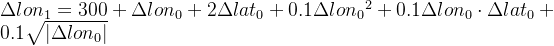

# 高精度WGS84与GCJ-02座标转换

https://www.twblogs.net/a/5efc63ffe94612e3fce9e393/?lang=zh-cn

https://blog.csdn.net/gudufuyun/article/details/106738942


## 一、转换原理

参见这一篇文章《使用ceres实现WGS84到GCJ-02座标相互转换》。

在上一篇日志提到，如果公开的WGS84座标到GSJ-02座标转换公式是精确公式，可借助Ceres自动求导进行高精度座标转换；如果公开的WGS84座标到GSJ-02座标转换公式并非精确公式，且国测局使用的转换公式依然是多项式，在黑箱模式下，通过调用国测局提供的加密插件的WGS84座标转GSJ-02座标API，利用Ceres数值求导方式，依然可以实现高精度座标转换。

利用Ceres库实现高精度转换已经是可行的，只是经过测试，Ceres的自动求导与数值求导相对于简单迭代法速度慢太多，在批量转换座标时，已经不具备实用性了。因此，这一篇日志对座标相互转换进行了改进。

1. 假定公开的WGS84转GCJ-02公式是精确公式：进行逆转换时，以GCJ-02座标为观测值，WGS84座标为未知数列误差方程，对误差方程进行泰勒展开，取线性项作为近似方程。通过解析求导计算线性化后误差方程的系数矩阵（雅克比矩阵），进行迭代求解，获得高精度的转换座标。
2. 假定未知WGS84转GCJ-02公式，但是可以调用加密插件API：与1中方法类似，只是计算误差方程系数矩阵时因为不知道数学模型而无法解析求导，可以利用数值求导做替代。数值求导的效率会低于解析求导，但依然可以在“黑箱模式”下获取高精度的转换座标。

公开的WGS84座标转GCJ-02座标公式为：





以  为观测值， 为未知数，列误差方程并线性化，则线性化后的误差方程为：


其中：


关于误差方程的系数矩阵，推导结果如下：


推导结果如下：


## 二、已知精确公式的解析求导法实现

代码如下：

```c++
/**
 *  \brief Covert geodetic coordinate in GCJ-02 coordinate system to geodetic coordinate
 *         in WGS84 coordinate system
 *
 *  \param [in] gcj02lon: longitude in GCJ-02 coordinate system [unit:degree]
 *  \param [in] gcj02lat: latitude in GCJ-02 coordinate system [unit:degree]
 *  \return Returns geodetic coordinate in WGS84 coordinate system
 *  \remark The encryption formula is known,and use the analytical derivation method to 
 *			solve the problem with high precision.
 *	\detail Assuming the encryption formula is 
 *
 *			gcj02lon = Wgs2Gcj(wgs84lon, wgs84lat)
 *			gcj02lat = Wgs2Gcj(wgs84lon, wgs84lat)
 *
 *	 In the rectification process, (wgs84lon, wgs84lat) are unknown items. Obviously,
 *   this is a system of nonlinear equations.
 *
 *   The linear formed error functions of forward intersection come from
 *   consideration of a Taylor series expansion.
 *           V = AX - b
 *    here:
 *    V: The residuals of the observed values
 *    A: The jacobian matrix
 *    X: The modification of the unknown items
 *    b: The constant terms of the error functions
 *
 *    Then the error functions written in vector form are:
 *    | V_lon | = | dlongcj_dlonwgs  dlongcj_dlatwgs |  | d_lonwgs | - | l_lon |
 *    | V_lat | = | dlatgcj_dlonwgs  dlatgcj_dlatwgs |  | d_latwgs | - | l_lat |
 *    here:
 *    l_lon = longcj - longcj'                 // the modification of longcj
 *    l_lat = latgcj - latgcj'                 // the modification of latgcj
 *    longcj : the observed longitude in GCJ-02
 *    latgcj : the observed latitude in GCJ-02
 *    longcj' = Wgs2Gcj(wgs84lon',wgs84lat')    // estimated longitude in GCJ-02
 *    latgcj' = Wgs2Gcj(wgs84lon',wgs84lat')    // estimated latitude in GCJ-02
 *    wgs84lon' : estimated longitude in WGS84
 *    wgs84lat' : estimated latitude in WGS84
 *    d_lonwgs : unknown items
 *    d_latwgs : unknown items
 *    wgs84lon = wgs84lon' + d_lonwgs                           // update
 *    wgs84lat = wgs84lat' + d_latwgs
 *
 *	  let V = [V_lon V_lat]T = 0, then
 *	  d_latwgs = (l_lon * dlatgcj_dlonwgs - l_lat * dlongcj_dlonwgs) /
 *			(dlongcj_dlatwgs * dlatgcj_dlonwgs - dlatgcj_dlatwgs * dlongcj_dlonwgs)
 *	  d_lonwgs = (l_lon - dlongcj_dlatwgs * d_latwgs) / dlongcj_dlonwgs
 *
 *    This iterative procedure is repeated until X= [d_lonwgs d_latwgs]T are
 *    sufficiently small.
 *  \time 01:54:46 2020/06/13
 */
std::pair<double, double> Gcj2Wgs_AnalyticDiff(const double& gcj02lon,
	const double& gcj02lat)
{
	double wgs84lon = gcj02lon, wgs84lat = gcj02lat;
	int nIterCount = 0;
	while (++nIterCount < 1000)
	{
		//get geodetic offset relative to 'center china'
		double lon0 = wgs84lon - 105.0;
		double lat0 = wgs84lat - 35.0;

		//generate an pair offset roughly in meters
		double lon1 = 300.0 + lon0 + 2.0 * lat0 + 0.1 * lon0 * lon0 + 0.1 * lon0 * lat0 + 0.1 * sqrt(fabs(lon0));
		lon1 = lon1 + (20.0 * sin(6.0 * lon0 * PI) + 20.0 * sin(2.0 * lon0 * PI)) * 2.0 / 3.0;
		lon1 = lon1 + (20.0 * sin(lon0 * PI) + 40.0 * sin(lon0 / 3.0 * PI)) * 2.0 / 3.0;
		lon1 = lon1 + (150.0 * sin(lon0 / 12.0 * PI) + 300.0 * sin(lon0 * PI / 30.0)) * 2.0 / 3.0;
		double lat1 = -100.0 + 2.0 * lon0 + 3.0 * lat0 + 0.2 * lat0 * lat0 + 0.1 * lon0 * lat0 + 0.2 * sqrt(fabs(lon0));
		lat1 = lat1 + (20.0 * sin(6.0 * lon0 * PI) + 20.0 * sin(2.0 * lon0 * PI)) * 2.0 / 3.0;
		lat1 = lat1 + (20.0 * sin(lat0 * PI) + 40.0 * sin(lat0 / 3.0 * PI)) * 2.0 / 3.0;
		lat1 = lat1 + (160.0 * sin(lat0 / 12.0 * PI) + 320.0 * sin(lat0 * PI / 30.0)) * 2.0 / 3.0;

		double g_lon0 = 0;
		if (lon0 > 0)
			g_lon0 = 0.05 / sqrt(lon0);
		else
			if (lon0 < 0)
				g_lon0 = -0.05 / sqrt(-lon0);
			else
				g_lon0 = 0;

		double PIlon0 = PI * lon0, PIlat0 = PI * lat0;
		double dlon1_dlonwgs = 1 + 0.2 * lon0 + 0.1 * lat0 + g_lon0
			+ ((120 * PI * cos(6 * PIlon0) + 40 * PI * cos(2 * PIlon0))
				+ (20 * PI * cos(PIlon0) + 40 * PI / 3.0 * cos(PIlon0 / 3.0))
				+ (12.5 * PI * cos(PIlon0 / 12.0) + 10 * PI * cos(PIlon0 / 30.0))) * 2.0 / 3.0;
		double dlon1_dlatwgs = 2 + 0.1 * lon0;

		double dlat1_dlonwgs = 2 + 0.1 * lat0 + 2 * g_lon0
			+ (120 * PI * cos(6 * PIlon0) + 40 * PI * cos(2 * PIlon0)) * 2.0 / 3.0;
		double dlat1_dlatwgs = 3 + 0.4 * lat0 + 0.1 * lon0
			+ ((20 * PI * cos(PIlat0) + 40.0 * PI / 3.0 * cos(PIlat0 / 3.0))
				+ (40 * PI / 3.0 * cos(PIlat0 / 12.0) + 32.0 * PI / 3.0 * cos(PIlat0 / 30.0))) * 2.0 / 3.0;

		//latitude in radian
		double B = Deg2Rad(wgs84lat);
		double sinB = sin(B), cosB = cos(B);
		double WSQ = 1 - kKRASOVSKY_ECCSQ * sinB * sinB;
		double W = sqrt(WSQ);
		double N = kKRASOVSKY_A / W;

		double dW_dlatwgs = -PI * kKRASOVSKY_ECCSQ * sinB * cosB / (180.0 * W);
		double dN_dlatwgs = -kKRASOVSKY_A * dW_dlatwgs / WSQ;

		double PIxNxCosB = PI * N * cosB;
		double dlongcj_dlonwgs = 1.0 + 180.0 * dlon1_dlonwgs / PIxNxCosB;
		double dlongcj_dlatwgs = 180 * dlon1_dlatwgs / PIxNxCosB -
			180 * lon1 * PI * (dN_dlatwgs * cosB - PI * N * sinB / 180.0) / (PIxNxCosB * PIxNxCosB);

		double PIxNxSubECCSQ = PI * N * (1 - kKRASOVSKY_ECCSQ);
		double dlatgcj_dlonwgs = 180 * WSQ * dlat1_dlonwgs / PIxNxSubECCSQ;
		double dlatgcj_dlatwgs = 1.0 + 180 * (N * (dlat1_dlatwgs * WSQ + 2.0 * lat1 * W * dW_dlatwgs) - lat1 * WSQ * dN_dlatwgs) /
			(N * PIxNxSubECCSQ);

		auto [gcj02lonEst, gcj02latEst] = Wgs2Gcj(wgs84lon, wgs84lat);
		double l_lon = gcj02lon - gcj02lonEst;
		double l_lat = gcj02lat - gcj02latEst;

		double d_latwgs = (l_lon * dlatgcj_dlonwgs - l_lat * dlongcj_dlonwgs) /
			(dlongcj_dlatwgs * dlatgcj_dlonwgs - dlatgcj_dlatwgs * dlongcj_dlonwgs);
		double d_lonwgs = (l_lon - dlongcj_dlatwgs * d_latwgs) / dlongcj_dlonwgs;

		if (fabs(d_latwgs) < 1.0e-9 && fabs(d_lonwgs) < 1.0e-9)
			break;
		wgs84lon = wgs84lon + d_lonwgs;
		wgs84lat = wgs84lat + d_latwgs;
	}
	return { wgs84lon, wgs84lat };
}
```


## 三、黑箱模式下的数值求导法实现

代码实现如下：

```c++
/**
 *  \brief Calculate the partial derivatives with respect to estimated longitude in WGS84
 *
 *  \param [in] wgs84lon: estimated longitude in WGS84 coordinate system [unit:degree]
 *  \param [in] wgs84lat: estimated latitude in WGS84 coordinate system [unit:degree]
 *  \param [in] dlon: delta longitude (close to zero) in WGS84 coordinate system [unit:degree], 
 *  \return Returns partial derivatives with respect to estimated longitude in WGS84
 *  \time 20:26:16 2020/06/13
 */
std::pair<double, double> GetPartialDerivative_Lon(const double& wgs84lon, const double& wgs84lat, const double& dlon)
{
	double lonBk = wgs84lon + dlon;
	double lonFw = wgs84lon - dlon;
	auto [gcjlonBk, gcjlatBk] = Wgs2Gcj(lonBk, wgs84lat);
	auto [gcjlonFw, gcjlatFw] = Wgs2Gcj(lonFw, wgs84lat);
	double dlongcj_dlonwgs = (gcjlonBk - gcjlonFw) / (dlon * 2.0);
	double dlatgcj_dlonwgs = (gcjlatBk - gcjlatFw) / (dlon * 2.0);
	return { dlongcj_dlonwgs , dlatgcj_dlonwgs };
}

/**
 *  \brief Calculate the partial derivatives with respect to estimated latitude in WGS84
 *
 *  \param [in] wgs84lon: estimated longitude in WGS84 coordinate system [unit:degree]
 *  \param [in] wgs84lat: estimated latitude in WGS84 coordinate system [unit:degree]
 *  \param [in] dlat: delta latitude (close to zero) in WGS84 coordinate system [unit:degree],
 *  \return Returns partial derivatives with respect to estimated latitude in WGS84
 *  \time 20:26:25 2020/06/13
 */
std::pair<double, double> GetPartialDerivative_Lat(const double& wgs84lon, const double& wgs84lat, const double& dlat)
{
	double latBk = wgs84lat + dlat;
	double latFw = wgs84lat - dlat;
	auto [gcjlonBk, gcjlatBk] = Wgs2Gcj(wgs84lon, latBk);
	auto [gcjlonFw, gcjlatFw] = Wgs2Gcj(wgs84lon, latFw);
	double dlongcj_dlatwgs = (gcjlonBk - gcjlonFw) / (dlat * 2.0);
	double dlatgcj_dlatwgs = (gcjlatBk - gcjlatFw) / (dlat * 2.0);
	return { dlongcj_dlatwgs , dlatgcj_dlatwgs };
}

/**
 *  \brief Covert geodetic coordinate in GCJ-02 coordinate system to geodetic coordinate
 *         in WGS84 coordinate system
 *
 *  \param [in] gcj02lon: longitude in GCJ-02 coordinate system [unit:degree]
 *  \param [in] gcj02lat: latitude in GCJ-02 coordinate system [unit:degree]
 *  \return Returns geodetic coordinate in WGS84 coordinate system
 *  \remark the encryption formula is unknown but we can covert point in WGS84 to point
 *          in GCJ-02 with an API,then use the numerical derivation method to solve the 
 *          problem
 *	\detail Assuming the encryption formula is
 *
 *			gcj02lon = Wgs2Gcj(wgs84lon, wgs84lat)
 *			gcj02lat = Wgs2Gcj(wgs84lon, wgs84lat)
 *
 *	 In the rectification process, (wgs84lon, wgs84lat) are unknown items. Obviously,
 *   this is a system of nonlinear equations.
 *
 *   The linear formed error functions of forward intersection come from
 *   consideration of a Taylor series expansion.
 *           V = AX - b
 *    here:
 *    V: The residuals of the observed values
 *    A: The jacobian matrix
 *    X: The modification of the unknown items
 *    b: The constant terms of the error functions
 *
 *    Then the error functions written in vector form are:
 *    | V_lon | = | dlongcj_dlonwgs  dlongcj_dlatwgs |  | d_lonwgs | - | l_lon |
 *    | V_lat | = | dlatgcj_dlonwgs  dlatgcj_dlatwgs |  | d_latwgs | - | l_lat |
 *    here:
 *    l_lon = longcj - longcj'                 // the modification of longcj
 *    l_lat = latgcj - latgcj'                 // the modification of latgcj
 *    longcj : the observed longitude in GCJ-02
 *    latgcj : the observed latitude in GCJ-02
 *    longcj' = Wgs2Gcj(wgs84lon',wgs84lat')    // estimated longitude in GCJ-02
 *    latgcj' = Wgs2Gcj(wgs84lon',wgs84lat')    // estimated latitude in GCJ-02
 *    wgs84lon' : estimated longitude in WGS84
 *    wgs84lat' : estimated latitude in WGS84
 *    d_lonwgs : unknown items
 *    d_latwgs : unknown items
 *    wgs84lon = wgs84lon' + d_lonwgs                           // update
 *    wgs84lat = wgs84lat' + d_latwgs
 *
 *	  let V = [V_lon V_lat]T = 0, then
 *	  d_latwgs = (l_lon * dlatgcj_dlonwgs - l_lat * dlongcj_dlonwgs) /
 *			(dlongcj_dlatwgs * dlatgcj_dlonwgs - dlatgcj_dlatwgs * dlongcj_dlonwgs)
 *	  d_lonwgs = (l_lon - dlongcj_dlatwgs * d_latwgs) / dlongcj_dlonwgs
 *
 *    This iterative procedure is repeated until X= [d_lonwgs d_latwgs]T are
 *    sufficiently small.
 *  \time 17:42:01 2020/06/12
 */
std::pair<double, double> Gcj2Wgs_NumbericDiff(const double& gcj02lon,
	const double& gcj02lat)
{
	double wgs84lon = gcj02lon, wgs84lat = gcj02lat;
	int nIterCount = 0;
	double tol = 1e-9;
	while (++nIterCount < 1000)
	{
		auto [dlongcj_dlonwgs, dlatgcj_dlonwgs] = GetPartialDerivative_Lon(wgs84lon, wgs84lat, tol);
		auto [dlongcj_dlatwgs, dlatgcj_dlatwgs] = GetPartialDerivative_Lat(wgs84lon, wgs84lat, tol);

		auto [gcj02lonEst, gcj02latEst] = Wgs2Gcj(wgs84lon, wgs84lat);
		double l_lon = gcj02lon - gcj02lonEst;
		double l_lat = gcj02lat - gcj02latEst;
		double d_latwgs = (l_lon * dlatgcj_dlonwgs - l_lat * dlongcj_dlonwgs) /
			(dlongcj_dlatwgs * dlatgcj_dlonwgs - dlatgcj_dlatwgs * dlongcj_dlonwgs);
		double d_lonwgs = (l_lon - dlongcj_dlatwgs * d_latwgs) / dlongcj_dlonwgs;

		if (fabs(d_latwgs) < tol && fabs(d_lonwgs) < tol)
			break;
		wgs84lon = wgs84lon + d_lonwgs;
		wgs84lat = wgs84lat + d_latwgs;
	}
	return { wgs84lon, wgs84lat };
}
```

## 四、全部代码及实验

代码已经上传至Git：https://github.com/kikkimo/WgsToGcj

批量座标转换时使用了OpenMP，需要C++ 17支持。

测试代码：

```c++
void TestCase1()
{
	double lonWgs = 116.39123343289631;
	double latWgs = 39.9072885060602;
	std::cout.precision(16);
	std::cout << "WGS84 Point: (" << lonWgs << ", " << latWgs << ")\n";
	auto [lonGcj, latGcj] = Wgs2Gcj(lonWgs, latWgs);
	std::cout << "GCJ-02 Point [Wgs2Gcj]: (" << lonGcj << ", " << latGcj << ")\n";
	//simple linear iteration 
	auto [lonWgsNS, latWgsNS] = Gcj2Wgs_SimpleIteration(lonGcj, latGcj);
	std::cout << "WGS84 Point [simple linear iteration]: (" << lonWgsNS << ", " << latWgsNS << ")\n";

	//numerically differentiated cost function
	auto [lonWgsND, latWgsND] = Gcj2Wgs_NumbericDiff(lonGcj, latGcj);
	std::cout << "WGS84 Point [numerically derivation]: (" << lonWgsND << ", " << latWgsND << ")\n";

	//analytical differentiated cost function
	auto [lonWgsNAn, latWgsNAn] = Gcj2Wgs_AnalyticDiff(lonGcj, latGcj);
	std::cout << "WGS84 Point [analytical derivation]: (" << lonWgsNAn << ", " << latWgsNAn << ")\n";

	//auto differentiable, use ceres
	auto [lonWgsNA, latWgsNA] = Gcj2Wgs_AutoDiff(lonGcj, latGcj);
	std::cout << "WGS84 Point [auto differentiable]: (" << lonWgsNA << ", " << latWgsNA << ")\n";
}

void TestCase2()
{
	//range of china
	std::vector<double> wgslonRange, wgslatRange;
	for (double wgslon = 72.004; wgslon <= 137.8347; wgslon += 0.01)
	{
		for (double wgslat = 0.8293; wgslat <= 55.8271; wgslat += 0.01)
		{
			if (OutOfChina(wgslon,wgslat))
				continue;
			wgslonRange.push_back(wgslon);
			wgslatRange.push_back(wgslat);
		}
	}
	size_t size = wgslonRange.size();
	assert(size == wgslatRange.size());
	double lfXMin = DBL_MAX;
	double lfXMax = 0.0l;
	double lfXAverage = 0.0l;
	double lfYMin = DBL_MAX;
	double lfYMax = 0.0l;
	double lfYAverage = 0.0l;
	int counts = 0;
	long t_begin = clock();
	#pragma omp parallel for
	for (long i = 0 ; i < size ; ++i )
	{
		auto [gcj02lon, gcj02lat] = Wgs2Gcj(wgslonRange[i], wgslatRange[i]);
		auto [wgslonN, wgslatN] = Gcj2Wgs_SimpleIteration(gcj02lon, gcj02lat);
		double lfXError = wgslonN - wgslonRange[i];
		double lfYError = wgslatN - wgslatRange[i];
		double lfXE = fabs(lfXError);
		double lfYE = fabs(lfYError);
		#pragma omp critical
		{
			lfXMin = fabs(lfXMin) < lfXE ? lfXMin : lfXError;
			lfXMax = fabs(lfXMax) > lfXE ? lfXMax : lfXError;
			lfYMin = fabs(lfYMin) < lfYE ? lfYMin : lfYError;
			lfYMax = fabs(lfYMax) > lfYE ? lfYMax : lfYError;
			lfXAverage += lfXE * lfXE;
			lfYAverage += lfYE * lfYE;
			counts++;
		}
	}
	lfXAverage /= counts;
	lfYAverage /= counts;
	lfXAverage = sqrt(lfXAverage);
	lfYAverage = sqrt(lfYAverage);
	long t_end = clock();
	std::cout << "| SimpleIteration: " << counts << " case finished!" << std::endl;
	std::cout << "| minimum X error: " << lfXMin << std::endl;
	std::cout << "| maximum X error: " << lfXMax << std::endl;
	std::cout << "| average X error: " << lfXAverage << std::endl;
	std::cout << "| minimum Y error: " << lfYMin << std::endl;
	std::cout << "| maximum Y error: " << lfYMax << std::endl;
	std::cout << "| average Y error: " << lfYAverage << std::endl;
	std::cout << "| time use: " << t_end - t_begin << " ms" << std::endl;

	lfXMin = DBL_MAX;
	lfXMax = 0.0l;
	lfXAverage = 0.0l;
	lfYMin = DBL_MAX;
	lfYMax = 0.0l;
	lfYAverage = 0.0l;
	counts = 0;
	t_begin = clock();
	#pragma omp parallel for 
	for (long i = 0; i < size; ++i)
	{
		auto [gcj02lon, gcj02lat] = Wgs2Gcj(wgslonRange[i], wgslatRange[i]);
		auto [wgslonN, wgslatN] = Gcj2Wgs_AnalyticDiff(gcj02lon, gcj02lat);
		double lfXError = wgslonN - wgslonRange[i];
		double lfYError = wgslatN - wgslatRange[i];
		double lfXE = fabs(lfXError);
		double lfYE = fabs(lfYError);
		#pragma omp critical
		{
			lfXMin = fabs(lfXMin) < lfXE ? lfXMin : lfXError;
			lfXMax = fabs(lfXMax) > lfXE ? lfXMax : lfXError;
			lfYMin = fabs(lfYMin) < lfYE ? lfYMin : lfYError;
			lfYMax = fabs(lfYMax) > lfYE ? lfYMax : lfYError;
			lfXAverage += lfXE * lfXE;
			lfYAverage += lfYE * lfYE;
			counts++;
		}
	}
	lfXAverage /= counts;
	lfYAverage /= counts;
	lfXAverage = sqrt(lfXAverage);
	lfYAverage = sqrt(lfYAverage);
	t_end = clock();
	std::cout << "| analytical derivation: " << counts << " case finished!" << std::endl;
	std::cout << "| minimum X error: " << lfXMin << std::endl;
	std::cout << "| maximum X error: " << lfXMax << std::endl;
	std::cout << "| average X error: " << lfXAverage << std::endl;
	std::cout << "| minimum Y error: " << lfYMin << std::endl;
	std::cout << "| maximum Y error: " << lfYMax << std::endl;
	std::cout << "| average Y error: " << lfYAverage << std::endl;
	std::cout << "| time use: " << t_end - t_begin << " ms" << std::endl;

	lfXMin = DBL_MAX;
	lfXMax = 0.0l;
	lfXAverage = 0.0l;
	lfYMin = DBL_MAX;
	lfYMax = 0.0l;
	lfYAverage = 0.0l;
	counts = 0;
	t_begin = clock();
	#pragma omp parallel for
	for (long i = 0; i < size; ++i)
	{
		auto [gcj02lon, gcj02lat] = Wgs2Gcj(wgslonRange[i], wgslatRange[i]);
		auto [wgslonN, wgslatN] = Gcj2Wgs_NumbericDiff(gcj02lon, gcj02lat);
		double lfXError = wgslonN - wgslonRange[i];
		double lfYError = wgslatN - wgslatRange[i];
		double lfXE = fabs(lfXError);
		double lfYE = fabs(lfYError);
		#pragma omp critical
		{
			lfXMin = fabs(lfXMin) < lfXE ? lfXMin : lfXError;
			lfXMax = fabs(lfXMax) > lfXE ? lfXMax : lfXError;
			lfYMin = fabs(lfYMin) < lfYE ? lfYMin : lfYError;
			lfYMax = fabs(lfYMax) > lfYE ? lfYMax : lfYError;
			lfXAverage += lfXE * lfXE;
			lfYAverage += lfYE * lfYE;
			counts++;
		}
	}
	lfXAverage /= counts;
	lfYAverage /= counts;
	lfXAverage = sqrt(lfXAverage);
	lfYAverage = sqrt(lfYAverage);
	t_end = clock();
	std::cout << "| numerically differentiated: " << counts << " case finished!" << std::endl;
	std::cout << "| minimum X error: " << lfXMin << std::endl;
	std::cout << "| maximum X error: " << lfXMax << std::endl;
	std::cout << "| average X error: " << lfXAverage << std::endl;
	std::cout << "| minimum Y error: " << lfYMin << std::endl;
	std::cout << "| maximum Y error: " << lfYMax << std::endl;
	std::cout << "| average Y error: " << lfYAverage << std::endl;
	std::cout << "| time use: " << t_end - t_begin << " ms" << std::endl;
}

int main()
{
	TestCase1();
	TestCase2();
	return 0;
}

```

运行结果如下：

```
WGS84 Point: (116.3912334328963, 39.9072885060602)
GCJ-02 Point [Wgs2Gcj]: (116.3974745525927, 39.9086897410389)
WGS84 Point [simple linear iteration]: (116.3912334328952, 39.90728850605925)
WGS84 Point [numerically derivation]: (116.3912334328919, 39.907288506063)
WGS84 Point [analytical derivation]: (116.3912334328963, 39.90728850606018)
WGS84 Point [auto differentiable]: (116.3912334328963, 39.9072885060602)
| SimpleIteration: 36212000 case finished!
| minimum X error: 0
| maximum X error: 1.004394789561047e-09
| average X error: 2.086478302359615e-10
| minimum Y error: 0
| maximum Y error: -1.000603822021162e-09
| average Y error: 1.797900081572686e-10
| time use: 9459 ms
| analytical derivation: 36212000 case finished!
| minimum X error: 0
| maximum X error: 1.00000363545405e-09
| average X error: 4.421800783102829e-11
| minimum Y error: 0
| maximum Y error: 9.999983063835316e-10
| average Y error: 5.382026050659488e-11
| time use: 14981 ms
| numerically differentiated: 36212000 case finished!
| minimum X error: 0
| maximum X error: 9.999894245993346e-10
| average X error: 2.799351482673353e-11
| minimum Y error: 0
| maximum Y error: 9.999894245993346e-10
| average Y error: 2.398002542388568e-11
| time use: 24988 ms
```


对全国范围内经纬度以0.01°间隔进行采样，获得全国范围内大地坐标格网点，将WGS84坐标转换为GCJ-02坐标后，分别用简单迭代法、解析求导法和数值求导法进行逆转换，统计转换误差。可以发现解析求导和数值求导转换精度比简单迭代法更高，相应地耗时也会增加！

